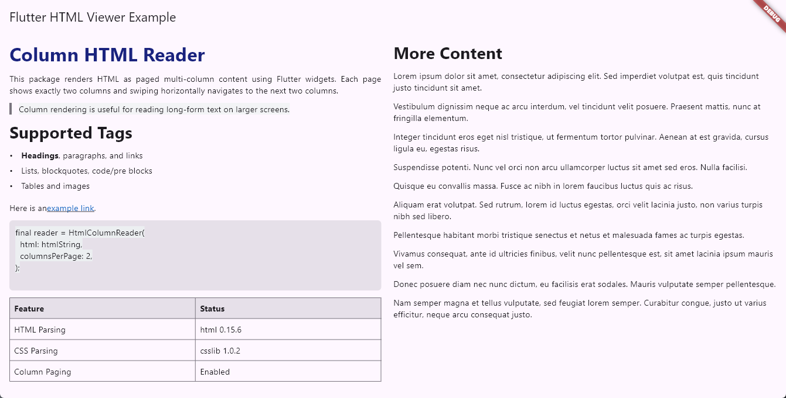

# flutter_html_column_viewer

**HTML in columns — built entirely with Flutter widgets.** No WebView, no platform views. Parse HTML, flow it into a paged multi-column layout, and swipe through pages like a magazine.

---

## Why this package?

Rendering HTML in Flutter usually means dropping in a `WebView` and losing native scrolling, theming, and control. **flutter_html_column_viewer** takes a different approach: it parses HTML and CSS (using `html` and `csslib`) and builds a **pure Flutter** widget tree. Text, headings, lists, tables, and images become `Text`, `RichText`, `Table`, and `Image` widgets. Content is laid out in **columns** with a fixed **columns per page**; users swipe horizontally to move to the next page of continued content. Ideal for article readers, documentation, or any app where you want HTML content that feels native and performant.

---

## Features

| Area | What you get |
|------|----------------|
| **Rendering** | 100% Flutter widgets — no WebView or platform views |
| **Layout** | Paged multi-column layout; set `columnsPerPage` and swipe between pages |
| **HTML** | Headings (h1–h6), paragraphs, links, lists, blockquote, `pre`/`code`, tables, images |
| **Styling** | Inline CSS subset: `color`, `background-color`, `font-size`, `font-weight`, `font-style`, `text-decoration`, `text-align` |

---

## Installation

Add to your `pubspec.yaml`:

```yaml
dependencies:
  flutter_html_column_viewer: ^0.0.1
```

---

## Usage

```dart
import 'package:flutter/material.dart';
import 'package:flutter_html_column_viewer/flutter_html_column_viewer.dart';

class ReaderPage extends StatelessWidget {
  const ReaderPage({super.key});

  @override
  Widget build(BuildContext context) {
    return Scaffold(
      body: HtmlColumnReader(
        html: '''
          <h1>My Article</h1>
          <p style="text-align: justify;">Long HTML content...</p>
        ''',
        columnsPerPage: 2,
        columnGap: 16,
        onLinkTap: (href) => debugPrint('Tapped: $href'),
      ),
    );
  }
}
```

**Key parameters:**

- **`columnsPerPage`** — Number of columns visible on each page (e.g. `2` for a two-column spread).
- **`columnGap`** — Space between columns.
- **`pagePadding`** — Padding around each page.
- **`textStyle`** / **`headingStyles`** — Base and heading text styles.
- **`onLinkTap`** — Callback when a link is tapped.
- **`imageBuilder`** — Optional custom builder for `` widgets.

---

## API summary

| Parameter | Type | Description |
|-----------|------|-------------|
| `html` | `String` | Source HTML |
| `columnsPerPage` | `int` | Columns per page (e.g. 2) |
| `columnGap` | `double` | Gap between columns |
| `pagePadding` | `EdgeInsetsGeometry` | Page padding |
| `textStyle` | `TextStyle?` | Base text style |
| `headingStyles` | `Map<int, TextStyle>` | Overrides for h1–h6 |
| `onLinkTap` | `void Function(String href)?` | Link tap callback |
| `imageBuilder` | `HtmlImageBuilder?` | Custom image widget |
| `parser` | `HtmlContentParser?` | Custom parser (advanced) |

---

## Example app

The `example/` app shows a full reader with two columns per page, horizontal page swipes, and a variety of HTML elements.



---

## License

See the repository for license details.
